# AI-Driven Data Vault Automation System
## Project Proposal for Complete Data Pipeline Automation

<div align="center">
  <h2>🚀 Autonomous Data Vault 2.0 Pipeline Generation</h2>
  <p><em>Revolutionizing Data Engineering with AI Agents</em></p>
  
  [](.)
  [](.)
  [](.)
  [](.)
</div>

---

## 📋 Executive Summary

This proposal outlines the implementation of an **AI-driven Data Vault automation system** that leverages LangChain agents to autonomously generate complete Data Vault 2.0 pipelines following the proper data flow: **Source → Raw Vault → Business Vault → Access Layer**. 

### 💰 Business Value

| Metric | Current State | With AI System | Improvement |
|--------|---------------|----------------|-------------|
| **Development Time** | 2-3 weeks per model | 2-3 days per model | **🚀 90% reduction** |
| **Code Quality** | Manual review required | Automated validation | **✅ 95%+ pass rate** |
| **Error Rate** | 15-20% manual errors | 2-5% system errors | **📉 80% reduction** |
| **Scalability** | 1-2 models/month | 10+ models/month | **📈 10x increase** |
| **Cost per Model** | $50,000 | $5,000 | **💰 90% cost savings** |

---

## 1. Project Overview

### 1.1 Objectives
- Automate complete Data Vault 2.0 pipeline generation following proper data flow
- Implement multi-agent system for different Data Vault layers
- Integrate with existing vault-etl-framework
- Provide autonomous schema analysis and business key identification
- Generate production-ready code with proper validation

### 1.2 Scope
- **Raw Vault Layer**: Hubs, Links, and Satellites (from source systems)
- **Business Vault Layer**: Business logic and derived entities (from Raw Vault)
- **Access Layer**: Presentation and reporting views (from Business Vault)
- **Framework Integration**: Automated vault-etl-framework updates
- **Quality Assurance**: Automated testing and validation

---

## 2. Technical Architecture

### 2.1 Data Flow Architecture

```
┌─────────────────┐    ┌─────────────────┐    ┌─────────────────┐    ┌─────────────────┐
│   Source Layer  │    │   Raw Vault     │    │  Business Vault │    │  Access Layer   │
│                 │    │                 │    │                 │    │                 │
│ • PostgreSQL    │───▶│ • Hubs          │───▶│ • Business Hubs │───▶│ • Presentation  │
│ • SAP           │    │ • Satellites    │    │ • Business      │    │   Views         │
│ • Salesforce    │    │ • Links         │    │ • etc.          │    │ • Dimensional   │
│ • etc.          │    │ • Link          │    │ • Business      │    │   Models        │
│                 │    │   Satellites    │    │   Links         │    │ • Reporting     │
└─────────────────┘    └─────────────────┘    └─────────────────┘    └─────────────────┘
```

### 🏗️ Technical Architecture

#### 🌊 Data Flow Architecture

```mermaid
graph LR
    A[📂 Source Layer<br/>PostgreSQL, SAP, Salesforce] --> B[🏗️ Raw Vault<br/>Hubs, Satellites, Links]
    B --> C[💼 Business Vault<br/>Business Logic, Rules]
    C --> D[📊 Access Layer<br/>Views, Dimensional Models]
    
    style A fill:#E8F4FD,stroke:#333,stroke-width:2px
    style B fill:#E8F8F5,stroke:#333,stroke-width:2px
    style C fill:#FDF2E9,stroke:#333,stroke-width:2px
    style D fill:#F3E5F5,stroke:#333,stroke-width:2px
```



#### 🤖 Multi-Agent System Design

```mermaid
graph TD
    A["🎯 Orchestrator Agent<br/>Master Coordinator"] --> B["🔍 Source Validation Agent"]
    A --> C["🏗️ Raw Vault Agent"]
    A --> D["💼 Business Vault Agent"]
    A --> E["📊 Access Layer Agent"]
    
    B --> B1["✅ Source Tables Validation"]
    B --> B2["📋 Schema Analysis"]
    B --> B3["🔗 Data Quality Check"]
    
    C --> C1["🏢 Hub Generation"]
    C --> C2["📡 Satellite Generation"]
    C --> C3["🔗 Link Generation"]
    C --> C4["🔗📡 Link Satellite Generation"]
    
    D --> D1["💼 Business Logic"]
    D --> D2["🔄 Derived Entities"]
    D --> D3["📋 Business Rules"]
    
    E --> E1["📊 Presentation Views"]
    E --> E2["⭐ Dimensional Models"]
    E --> E3["📚 Documentation"]
    
    F["📂 Source Tables"] --> B
    B --> G["✅ Validated Sources"]
    G --> C
    C --> H["🏗️ Raw Vault Components"]
    H --> D
    D --> I["💼 Business Vault Components"]
    I --> E
    E --> J["📊 Access Layer Components"]
    
    style A fill:#FFE165,stroke:#333,stroke-width:3px
    style B fill:#E8F4FD,stroke:#333,stroke-width:2px
    style C fill:#E8F8F5,stroke:#333,stroke-width:2px
    style D fill:#FDF2E9,stroke:#333,stroke-width:2px
    style E fill:#F3E5F5,stroke:#333,stroke-width:2px
```



#### **🎯 Orchestrator Agent** (Master Coordinator)
> Central command that coordinates all sub-agents following proper data flow

#### **Stage 1: 🔍 Source Layer Agents**
| Agent | Purpose | Key Outputs |
|-------|---------|-------------|
| **Source Validation Agent** 🔍 | Validate source tables exist in landing zone | ✅ Validation reports |
| **Schema Analysis Agent** 📊 | Analyze source schema and business context | 📋 Business key identification |

#### **Stage 2: 🏗️ Raw Vault Layer Agents**
| Agent | Purpose | Key Outputs |
|-------|---------|-------------|
| **Hub Generation Agent** 🏢 | Create hub scripts with business keys | 🏗️ Hub Python scripts |
| **Satellite Generation Agent** 📡 | Create satellite scripts for source tables | 📡 Satellite Python scripts |
| **Link Generation Agent** 🔗 | Create link scripts for relationships | 🔗 Link Python scripts |
| **Link Satellite Agent** 🔗📡 | Create link satellite scripts | 🔗📡 Link satellite scripts |

#### **Stage 3: 💼 Business Vault Layer Agents**
| Agent | Purpose | Key Outputs |
|-------|---------|-------------|
| **Business Logic Agent** 💼 | Create business logic and transformations | 💼 Business scripts |
| **Derived Entity Agent** 🔄 | Generate derived entities and calculations | 🔄 Derived entity scripts |
| **Business Rules Agent** 📋 | Implement business rules and aggregations | 📋 Business rule scripts |

#### **Stage 4: 📊 Access Layer Agents**
| Agent | Purpose | Key Outputs |
|-------|---------|-------------|
| **Presentation View Agent** 📊 | Create flattened presentation views | 📊 Presentation views |
| **Dimensional Model Agent** ⭐ | Generate star/snowflake schemas | ⭐ Dimensional models |
| **Documentation Agent** 📚 | Generate documentation and metadata | 📚 Technical docs |

#### **Stage 5: 🔧 Framework Integration Agents**
| Agent | Purpose | Key Outputs |
|-------|---------|-------------|
| **Framework Integration Agent** 🔧 | Update vault-etl-framework | 🔧 Framework updates |
| **Migration Script Agent** 📦 | Generate migration scripts | 📦 Migration scripts |

## 🌊 Complete End-to-End Agent Flow with Groq API Integration

### 🔄 **Streamlined Agentic Framework Flow**

```mermaid
graph TD
    %% User Input
    A["👤 User Input<br/>--model credit_risk<br/>--source-tables apps:id(int),amount(decimal)<br/>--business-context Credit risk assessment"]
    
    %% Orchestrator
    B["🎯 Orchestrator Agent<br/>Parse & Coordinate"]
    
    %% Stage 1: Source Layer (Vertical)
    subgraph "🔍 Source Layer"
        C1["🔍 Source Validation Agent<br/>🤖 LLM Call"]
        C2["📊 Schema Analysis Agent<br/>🤖 LLM Call"]
    end
    
    %% Stage 2: Raw Vault Layer (Horizontal - Parallel)
    subgraph "🏗️ Raw Vault Layer"
        D1["🏢 Hub Generation Agent<br/>🤖 LLM Call"]
        D2["📡 Satellite Generation Agent<br/>🤖 LLM Call"]
        D3["🔗 Link Generation Agent<br/>🤖 LLM Call"]
    end
    
    %% Stage 3: Business Vault Layer (Vertical)
    subgraph "💼 Business Vault Layer"
        E1["💼 Business Logic Agent<br/>🤖 LLM Call"]
        E2["🔄 Derived Entity Agent<br/>🤖 LLM Call"]
    end
    
    %% Stage 4: Access Layer (Vertical)
    subgraph "📊 Access Layer"
        F1["📊 Presentation View Agent<br/>🤖 LLM Call"]
        F2["⭐ Dimensional Model Agent<br/>🤖 LLM Call"]
    end
    
    %% Stage 5: Framework Integration (Vertical)
    subgraph "🔧 Framework Integration"
        G1["🔧 Framework Integration Agent<br/>🤖 LLM Call"]
        G2["📦 Migration Script Agent<br/>🤖 LLM Call"]
    end
    
    %% Output
    H["📦 Complete Data Vault Pipeline<br/>8-12 Python Files Ready for Deployment"]
    
    %% Flow connections
    A --> B
    B --> C1
    C1 --> C2
    C2 --> D1
    C2 --> D2
    C2 --> D3
    
    D1 --> E1
    D2 --> E1
    D3 --> E1
    
    E1 --> E2
    E2 --> F1
    F1 --> F2
    F2 --> G1
    G1 --> G2
    G2 --> H
    
    %% Styling
    classDef userInput fill:#A8E6CF,stroke:#00b894,stroke-width:2px
    classDef orchestrator fill:#FFE66D,stroke:#FFA502,stroke-width:2px
    classDef sourceLayer fill:#E8F8F5,stroke:#27AE60,stroke-width:2px
    classDef rawVaultLayer fill:#FDF2E9,stroke:#E67E22,stroke-width:2px
    classDef businessLayer fill:#F4ECF7,stroke:#8E44AD,stroke-width:2px
    classDef accessLayer fill:#FDEDEC,stroke:#E74C3C,stroke-width:2px
    classDef frameworkLayer fill:#EAEDED,stroke:#34495E,stroke-width:2px
    classDef output fill:#DDA0DD,stroke:#8B008B,stroke-width:2px
    
    class A userInput
    class B orchestrator
    class C1,C2 sourceLayer
    class D1,D2,D3 rawVaultLayer
    class E1,E2 businessLayer
    class F1,F2 accessLayer
    class G1,G2 frameworkLayer
    class H output
```



### 🏗️ **High-Level GenAI Multi-Agent Architecture: Data Vault Copilot**

```mermaid
graph TD
    %% User Input
    U["👤 Data Engineer<br/>Initiates Data Vault Pipeline Generation<br/>Input: --model credit_risk --source-tables apps:id(int),amount(decimal)"]
    
    %% Groq API & LLM Integration
    G["🤖 Groq API<br/>llama3-70b-8192<br/>Powers all agent intelligence"]
    
    %% Orchestrator
    O["🎯 Orchestrator Agent<br/>Master Coordinator & Task Delegator"]
    
    %% Master Agents
    MA1["🏗️ Raw Vault Master Agent<br/>Generates Raw Hubs, Satellites, Links<br/>Source: Landing Zone Tables"]
    MA2["💼 Business Vault Master Agent<br/>Generates Business Hubs, Satellites, Links<br/>Source: Raw Vault Components"]
    MA3["📊 Access Layer Master Agent<br/>Creates Dimensional Models<br/>Source: Business Vault Components"]
    MA4["🔧 Vault ETL Framework Agent<br/>Updates Source.py, Enums, Abbreviations<br/>Provides: Framework Functions"]
    MA5["📋 Model Agent<br/>Handles Model Configurations<br/>Updates: model/access_layer/, model/enum/, model/vault/"]
    MA6["✅ Data Quality Framework Agent<br/>Validates Data Quality & Compliance"]
    
    %% Raw Vault Sub-Agents
    subgraph "Raw Vault Sub-Agents"
        RHA["🏢 Raw Hub Agent<br/>Creates raw_hub scripts"]
        RSA["📡 Raw Satellite Agent<br/>Creates raw_hub_satellite scripts"]
        RLA["🔗 Raw Link Agent<br/>Creates raw_link scripts"]
        RLSA["🔗📡 Raw Link Satellite Agent<br/>Creates raw_link_satellite scripts"]
    end
    
    %% Business Vault Sub-Agents
    subgraph "Business Vault Sub-Agents"
        BHA["🏢 Business Hub Agent<br/>Creates business_hub scripts"]
        BSA["📡 Business Satellite Agent<br/>Creates business_hub_satellite scripts"]
        BLA["🔗 Business Link Agent<br/>Creates business_link scripts"]
        BLSA["🔗📡 Business Link Satellite Agent<br/>Creates business_link_satellite scripts"]
        BBA["🌉 Bridge Agent<br/>Creates bridge scripts"]
        BPA["📅 Point-in-Time Agent<br/>Creates point_in_time scripts"]
    end
    
    %% Access Layer Sub-Agents
    subgraph "Access Layer Sub-Agents"
        PA["📊 Presentation View Agent<br/>Creates flattened views"]
        DMA["⭐ Dimensional Model Agent<br/>Generates star schemas"]
        DOCA["📚 Documentation Agent<br/>Creates technical docs"]
    end
    
    %% Quality Control
    subgraph "Quality Control"
        HIL["👨‍💼 Human in the Loop<br/>Reviews & Approves Code"]
        QA["🔍 Quality Assurance<br/>Validates Framework Compliance"]
    end
    
    %% Final Output
    OUT["📦 Complete Data Vault Pipeline<br/>Raw Vault + Business Vault + Access Layer<br/>All Framework Updates & Model Configurations"]
    
    %% Flow Connections
    U --> O
    O --> MA1
    O --> MA2
    O --> MA3
    O --> MA4
    O --> MA5
    O --> MA6
    
    %% Master Agents to Sub-Agents
    MA1 --> RHA
    MA1 --> RSA
    MA1 --> RLA
    MA1 --> RLSA
    
    MA2 --> BHA
    MA2 --> BSA
    MA2 --> BLA
    MA2 --> BLSA
    MA2 --> BBA
    MA2 --> BPA
    
    MA3 --> PA
    MA3 --> DMA
    MA3 --> DOCA
    
    %% Master Agent Communication (Data Flow)
    MA1 --> MA2
    MA2 --> MA3
    MA4 --> MA1
    MA4 --> MA2
    MA4 --> MA3
    MA5 --> MA1
    MA5 --> MA2
    MA5 --> MA3
    
    %% Groq API Connections
    G --> MA1
    G --> MA2
    G --> MA3
    G --> MA4
    G --> MA5
    G --> MA6
    
    %% Quality Control Flow
    RHA --> HIL
    RSA --> HIL
    RLA --> HIL
    RLSA --> HIL
    BHA --> HIL
    BSA --> HIL
    BLA --> HIL
    BLSA --> HIL
    BBA --> HIL
    BPA --> HIL
    PA --> HIL
    DMA --> HIL
    DOCA --> HIL
    
    HIL --> QA
    QA --> OUT
    
    %% Styling
    classDef userInput fill:#FFE165,stroke:#333,stroke-width:2px,color:#333
    classDef groqAPI fill:#FF4757,stroke:#333,stroke-width:3px,color:#fff
    classDef orchestrator fill:#FF6B6B,stroke:#333,stroke-width:3px,color:#fff
    classDef masterAgent fill:#4ECDC4,stroke:#333,stroke-width:2px,color:#fff
    classDef rawVaultSub fill:#45B7D1,stroke:#333,stroke-width:2px,color:#fff
    classDef businessVaultSub fill:#96CEB4,stroke:#333,stroke-width:2px,color:#fff
    classDef accessLayerSub fill:#FFEAA7,stroke:#333,stroke-width:2px,color:#333
    classDef qualityControl fill:#F4ECF7,stroke:#8E44AD,stroke-width:2px
    classDef output fill:#A8E6CF,stroke:#333,stroke-width:2px,color:#333
    
    class U userInput
    class G groqAPI
    class O orchestrator
    class MA1,MA2,MA3,MA4,MA5,MA6 masterAgent
    class RHA,RSA,RLA,RLSA rawVaultSub
    class BHA,BSA,BLA,BLSA,BBA,BPA businessVaultSub
    class PA,DMA,DOCA accessLayerSub
    class HIL,QA qualityControl
    class OUT output
```



### 🎯 **Key Technologies & Components**

- **🤖 Groq API (llama3-70b-8192)**: Powers all agent intelligence and code generation
- **🏗️ LangChain**: Framework for building the agent graph and orchestration
- **🔧 vault-etl-framework**: Target framework for generated code integration
- **👨‍💼 HIL - Human in the Loop**: Ensures quality control and oversight
- **📊 Multi-Agent Custom Automation Engine**: Underlying platform for agent orchestration

### 🔄 **Process Flow Summary**

1. **👤 Data Engineer** initiates request with model parameters
2. **🎯 Orchestrator** coordinates and delegates to **Master Agents**
3. **🏗️ Raw Vault Master Agent** generates hubs, satellites, links with sub-agents
4. **💼 Business Vault Master Agent** creates business logic and rules
5. **📊 Access Layer Master Agent** builds dimensional models
6. **🔧 Vault ETL Framework Agent** updates framework components
7. **📋 Model Agent** handles model-specific configurations
8. **✅ Data Quality Framework Agent** validates quality and compliance
9. **👨‍💼 Human in the Loop** reviews and approves all generated code
10. **📦 Complete Pipeline** delivered with 8-12 Python files

### 🔍 **Layer-by-Layer Breakdown with LLM Integration**

#### 🎯 **Layer 1: Orchestrator Layer**
```
📥 INPUT:  --model 'credit_risk_v3' --source-tables 'apps:id(int),amount(decimal)' --business-context 'Credit risk'
📤 OUTPUT: Parsed configuration object with model metadata and agent coordination plan
🧠 LOGIC:  Pure Python processing - no LLM calls, just command parsing and agent orchestration
```

#### 🔍 **Layer 2: Source Validation Layer**
```
📥 INPUT TO AGENT:     Raw table string: 'apps:id(int),amount(decimal)'
📤 INPUT TO GROQ:      Prompt: "Validate and parse this table definition for Data Vault..."
🤖 GROQ PROCESSING:    llama3-70b-8192 analyzes table structure, identifies primary keys, validates types
📥 GROQ RESPONSE:      JSON: {"status": "valid", "primary_key": "id", "columns": [...]}
📤 OUTPUT FROM AGENT:  Validated TableDefinition objects with confirmed schema
```

#### 📊 **Layer 3: Schema Analysis Layer**
```
📥 INPUT TO AGENT:     Validated table definitions + business context: 'Credit risk assessment'
📤 INPUT TO GROQ:      Prompt: "Analyze these tables for Data Vault business keys and relationships..."
🤖 GROQ PROCESSING:    llama3-70b-8192 identifies business keys, foreign key relationships, suggests vault components
📥 GROQ RESPONSE:      JSON: {"business_keys": ["id"], "hub_recommendations": ["APPLICATION_HUB"], ...}
📤 OUTPUT FROM AGENT:  Schema analysis with hub/satellite recommendations and relationship mapping
```

#### 🏗️ **Layer 4: Raw Vault Generation Layer**

**Hub Generation Sub-Layer:**
```
📥 INPUT TO AGENT:     Business keys: ['id'], model_name: 'credit_risk_v3', source_table: 'apps'
📤 INPUT TO GROQ:      Prompt: "Generate Data Vault hub script using vault-etl-framework..." + LGD examples
🤖 GROQ PROCESSING:    llama3-70b-8192 follows patterns from training examples to generate complete Python script
📥 GROQ RESPONSE:      Complete Python script with imports, TableMapping, BusinessKey, Query logic
📤 OUTPUT FROM AGENT:  credit_risk_v3_application_hub.py file with executable Data Vault hub code
```

**Satellite Generation Sub-Layer:**
```
📥 INPUT TO AGENT:     Hub info: APPLICATION_HUB, source columns: ['amount'], field mappings needed
📤 INPUT TO GROQ:      Prompt: "Generate satellite script joining to hub..." + satellite patterns
🤖 GROQ PROCESSING:    llama3-70b-8192 creates field mappings, join logic, data type conversions
📥 GROQ RESPONSE:      Python script with detailed FieldMapping objects and hub join logic
📤 OUTPUT FROM AGENT:  credit_risk_v3_application_satellite.py + satellite_fields.py files
```

#### 💼 **Layer 5: Business Vault Layer**
```
📥 INPUT TO AGENT:     Raw vault components: [hub, satellite], business context: 'credit risk'
📤 INPUT TO GROQ:      Prompt: "Generate business vault with risk categorization rules..."
🤖 GROQ PROCESSING:    llama3-70b-8192 creates business logic, aggregations, derived calculations
📥 GROQ RESPONSE:      Python script with CASE statements, aggregations, business view logic
📤 OUTPUT FROM AGENT:  credit_risk_v3_business_view.py with domain-specific business rules
```

#### 📊 **Layer 6: Access Layer**
```
📥 INPUT TO AGENT:     Business vault components, reporting requirements: 'star schema for analytics'
📤 INPUT TO GROQ:      Prompt: "Generate dimensional model with fact tables and dimensions..."
🤖 GROQ PROCESSING:    llama3-70b-8192 designs star schema, identifies measures and dimensions
📥 GROQ RESPONSE:      Python script with FactTable, Dimension objects, measure definitions
📤 OUTPUT FROM AGENT:  credit_risk_v3_fact_applications.py with complete dimensional model
```

#### 🔧 **Layer 7: Framework Integration Layer**
```
📥 INPUT TO AGENT:     All generated components: [hub, satellite, business, access] scripts
📤 INPUT TO GROQ:      Prompt: "Generate framework integration updates for vault-etl-framework..."
🤖 GROQ PROCESSING:    llama3-70b-8192 creates source definitions, enum updates, migration scripts
📥 GROQ RESPONSE:      Framework update code: Source.py additions, RawHub enum updates, migrations
📤 OUTPUT FROM AGENT:  Updated vault-etl-framework files + migration scripts for deployment
```

### 🔄 **Complete Data Transformation Flow**

```
User Command Line Input:
"--model credit_risk_v3 --source-tables 'apps:id(int),amount(decimal)'"
                    ↓
🎯 Orchestrator: Parse arguments into structured config
                    ↓
🔍 Source Validation + Groq: Raw string → Validated schema objects
                    ↓
📊 Schema Analysis + Groq: Schema + context → Business keys + recommendations
                    ↓
🏗️ Hub Generation + Groq: Business keys → Complete hub Python script
                    ↓
📡 Satellite Generation + Groq: Hub + fields → Complete satellite Python script
                    ↓
💼 Business Vault + Groq: Raw components → Business logic Python script
                    ↓
📊 Access Layer + Groq: Business components → Dimensional model Python script
                    ↓
🔧 Framework Integration + Groq: All components → Framework updates + migrations
                    ↓
📦 Final Output: Complete Data Vault pipeline (8-12 Python files) ready for deployment
```

### 🎯 **API Call Summary**

| Layer | Agent | Groq Input | Groq Output | Final Agent Output |
|-------|-------|------------|-------------|-----------------|
| **🔍 Source** | Source Validation | `'apps:id(int),amount(decimal)'` | `{"status": "valid", "primary_key": "id"}` | Validated TableDefinition objects |
| **📊 Schema** | Schema Analysis | Validated tables + `'credit risk context'` | `{"business_keys": ["id"], "hubs": ["APP_HUB"]}` | Business key recommendations |
| **🏢 Hub** | Hub Generation | Business keys + model name + examples | Complete Python hub script | `credit_risk_v3_application_hub.py` |
| **📡 Satellite** | Satellite Generation | Hub info + source columns + examples | Complete Python satellite script | `credit_risk_v3_application_satellite.py` |
| **💼 Business** | Business Vault | Raw components + business context | Business logic with aggregations | `credit_risk_v3_business_view.py` |
| **📊 Access** | Access Layer | Business components + reporting needs | Star schema with fact tables | `credit_risk_v3_fact_applications.py` |
| **🔧 Framework** | Framework Integration | All components + framework patterns | Framework updates + migrations | Updated `vault-etl-framework` |

### 🚀 **Agentic Framework Advantages**

#### 🎯 **Why This Multi-Agent Approach Works**

1. **🧠 Specialized Intelligence**: Each agent is expert in one domain (validation, schema, generation)
2. **🔄 Chain of Reasoning**: Each agent builds upon the previous agent's validated output
3. **🤖 LLM Leveraging**: Each agent uses Groq's llama3-70b-8192 for domain-specific tasks
4. **✅ Quality Assurance**: Multi-layer validation ensures high-quality output
5. **🔧 Framework Consistency**: All agents follow vault-etl-framework patterns

#### 📊 **Input/Output Transformation Examples**

**Example 1: Credit Risk Model**
```
📥 INPUT:    "--model credit_risk --source-tables 'applications:app_id(int),amount(decimal)'"
📤 OUTPUT:   8 Python files implementing complete Data Vault pipeline
⏱️ TIME:     ~2-3 minutes (7 Groq API calls)
💰 COST:     ~$0.50 per model (estimated Groq API costs)
```

**Example 2: Fraud Detection Model**
```
📥 INPUT:    "--model fraud_detection --source-tables 'transactions:txn_id(int),amount(decimal),merchant(varchar)'"
📤 OUTPUT:   10 Python files with fraud-specific business logic
⏱️ TIME:     ~2-3 minutes (7 Groq API calls)
💰 COST:     ~$0.50 per model (estimated Groq API costs)
```

#### 🎯 **Agent Orchestration Benefits**

- **🔀 Parallel Processing**: Some agents can run in parallel (satellite generation)
- **🔄 Error Recovery**: If one agent fails, system can retry or fallback
- **📈 Scalability**: Add new agents for new vault layers (links, point-in-time tables)
- **🧪 Testing**: Each agent can be unit tested independently
- **🔧 Maintenance**: Update one agent without affecting others

### 🏆 **System Intelligence Highlights**

1. **📊 Schema Intelligence**: Automatically identifies business keys from table structures
2. **🔗 Relationship Intelligence**: Detects foreign key relationships and suggests links
3. **💼 Business Logic Intelligence**: Generates domain-appropriate business rules
4. **🎯 Framework Intelligence**: Maintains consistency with existing vault-etl-framework patterns
5. **📚 Learning Intelligence**: Uses LGD model examples to guide generation patterns

## 🔄 Complete Pipeline Flow: Source → Raw Vault → Business Vault → Access Layer

#### 🤖 **API Call #1: Source Validation**
```json
{
  "model": "llama3-70b-8192",
  "messages": [
    {
      "role": "system", 
      "content": "You are a Data Vault expert. Validate and parse source table definitions."
    },
    {
      "role": "user",
      "content": "Parse these source tables: 'credit_applications:app_id(int),customer_id(int),amount(decimal),status(varchar);decisions:decision_id(int),app_id(int),outcome(varchar)' for model 'credit_risk_v3'"
    }
  ],
  "response": {
    "validation_status": "SUCCESS",
    "tables": [
      {
        "name": "credit_applications",
        "primary_key": "app_id", 
        "columns": ["app_id(int)", "customer_id(int)", "amount(decimal)", "status(varchar)"]
      }
    ]
  }
}
```

#### 🤖 **API Call #3: Hub Generation**
```json
{
  "model": "llama3-70b-8192", 
  "messages": [
    {
      "role": "system",
      "content": "Generate Data Vault 2.0 hub scripts using vault-etl-framework patterns. Follow LGD model examples exactly."
    },
    {
      "role": "user", 
      "content": "Generate hub script for business_key: 'app_id', model_name: 'credit_risk_v3', source_table: 'credit_applications'"
    }
  ],
  "response": {
    "script_name": "credit_risk_v3_application_hub.py",
    "script_content": "from model.source import Source\nfrom model.vault.raw_hub import RawHub\n..."
  }
}
```

#### 🤖 **API Call #6: Business Vault Generation**
```json
{
  "model": "llama3-70b-8192",
  "messages": [
    {
      "role": "system",
      "content": "Generate business vault scripts with aggregations and business rules."
    },
    {
      "role": "user",
      "content": "Create business vault for raw vault components: ['credit_risk_v3_application_hub', 'credit_risk_v3_application_satellite'] with business context: 'Credit risk assessment with approval rates and risk categorization'"
    }
  ],
  "response": {
    "script_name": "credit_risk_v3_business_view.py",
    "business_rules": ["risk_category = CASE WHEN credit_score > 750 THEN 'LOW' ELSE 'HIGH' END"],
    "aggregations": ["total_applications", "approval_rate", "avg_credit_score"]
  }
}
```

### 🔄 **Data Flow Through Agent Chain**

#### 📊 **Input Data Transformation**
```
User Input: "--model credit_risk --source-tables 'apps:id(int),amount(decimal)'"
    ↓
Orchestrator Agent: Parse command line arguments
    ↓
Source Validation Agent → Groq: "Validate table structure"
    ↓
Schema Analysis Agent → Groq: "Find business keys in validated tables"
    ↓
Hub Generation Agent → Groq: "Generate hub script with business key 'id'"
    ↓
Satellite Generation Agent → Groq: "Generate satellite with fields ['amount']"
    ↓
Business Vault Agent → Groq: "Create business logic for credit risk domain"
    ↓
Access Layer Agent → Groq: "Generate star schema for credit reporting"
    ↓
Framework Integration Agent → Groq: "Update framework with new components"
    ↓
Output: Complete Data Vault pipeline with 15+ Python files
```

### 🎯 **Agent Communication Protocol**

Each agent follows this pattern:
1. **📥 Receive**: Structured input from previous agent
2. **🤖 Process**: Send formatted prompt to Groq API
3. **📤 Transform**: Parse Groq response into structured output
4. **✅ Validate**: Quality check generated content
5. **🔄 Forward**: Pass results to next agent in chain

## 🔄 Complete Pipeline Flow: Source → Raw Vault → Business Vault → Access Layer

### 🎯 **Multi-Model Architecture Strategy**

The system is designed to be **100% model-agnostic** and supports unlimited data models:

| Model Type | Example Use Cases | Generated Components |
|------------|-------------------|---------------------|
| **🏦 Credit Risk Models** | LGD, PD, EAD assessments | Hubs: Application, Customer<br/>Satellites: Risk scores, Decisions |
| **🔍 Fraud Detection Models** | Transaction monitoring, AML | Hubs: Transaction, Account<br/>Satellites: Fraud scores, Alerts |
| **📊 Customer Analytics** | Behavioral scoring, segmentation | Hubs: Customer, Product<br/>Satellites: Behavior, Preferences |
| **⚠️ Early Warning Systems** | Risk monitoring, alerts | Hubs: Signal, Input<br/>Satellites: Scores, Predictions |
| **📈 Marketing Models** | Campaign effectiveness, targeting | Hubs: Campaign, Customer<br/>Satellites: Responses, Metrics |
| **🔧 ANY Custom Model** | Domain-specific requirements | **Dynamically Generated** based on input |

### 🚀 **Universal Input Interface**
```bash
# Command works for ANY model - just change parameters
python generate_vault_model.py \
  --model "your_model_name" \
  --source-tables "table1:col1(type1),col2(type2);table2:col3(type3)" \
  --business-context "Your business description" \
  --output-dir "generated/your_model/"
```

### 🏗️ **Dynamic Generation Capabilities**
- ✅ **Schema-Agnostic**: Handles any source table structure
- ✅ **Business-Rule Flexible**: Adapts to any business logic  
- ✅ **Naming Convention Dynamic**: Uses model-specific naming
- ✅ **Framework Integration**: Updates vault-etl-framework automatically
- ✅ **Quality Validation**: Ensures code quality regardless of model complexity

### 📋 Stage 1: Source Validation & Analysis

#### 🔍 **Input: Generic Source Tables in Landing Zone**
```sql
-- Example Model A: Credit Risk Assessment
TABLE: credit_applications
├── application_id (int, PK) 🔑
├── customer_id (int, FK)
├── application_amount (decimal)
├── credit_score (int)
├── application_date (timestamp)
└── status (varchar)

TABLE: credit_decisions
├── decision_id (int, PK) 🔑
├── application_id (int, FK)
├── decision_outcome (varchar)
├── risk_rating (varchar)
└── decision_date (timestamp)

-- Example Model B: Customer Behavior Analytics  
TABLE: transaction_events
├── transaction_id (int, PK) 🔑
├── account_id (int, FK)
├── transaction_amount (decimal)
├── merchant_category (varchar)
└── transaction_timestamp (timestamp)

-- Example Model C: Fraud Detection
TABLE: fraud_alerts
├── alert_id (int, PK) 🔑
├── transaction_id (int, FK)
├── fraud_probability (decimal)
├── alert_type (varchar)
└── created_timestamp (timestamp)
```

#### 🔍 **Source Validation Agent Process**

```mermaid
graph LR
    A[📂 Source Tables] --> B{🔍 Table Exists?}
    B -->|Yes| C{🔐 Access Check?}
    B -->|No| D[❌ Error: Table Missing]
    C -->|Valid| E{📊 Data Quality?}
    C -->|Invalid| F[❌ Error: No Access]
    E -->|>95%| G[✅ Validation Passed]
    E -->|<95%| H[⚠️ Warning: Low Quality]
    
    style G fill:#90EE90
    style D fill:#FFB6C1
    style F fill:#FFB6C1
    style H fill:#FFE4B5
```


#### ✅ **Source Validation Agent Output (Multi-Model Support)**
```yaml
🔍 Source Validation Results:
validation_status: SUCCESS
model_name: "credit_risk_assessment_v2"  # Dynamic model name
tables_validated:
  - name: credit_applications
    status: ✅ VALID
    location: landing_zone.credit_applications
    record_count: 1,250,000
    data_quality: 99.8%
    last_updated: "2024-01-15T10:30:00Z"
    
  - name: credit_decisions  
    status: ✅ VALID
    location: landing_zone.credit_decisions
    record_count: 850,000
    data_quality: 99.5%
    last_updated: "2024-01-15T10:25:00Z"

  - name: transaction_events
    status: ✅ VALID
    location: landing_zone.transaction_events
    record_count: 5,000,000
    data_quality: 98.9%
    last_updated: "2024-01-15T10:20:00Z"

permissions:
  read_access: ✅ GRANTED
  schema_access: ✅ GRANTED
  
connectivity:
  source_system: ✅ ACCESSIBLE
  network_latency: 15ms

# System supports ANY model - just change input parameters
supported_models: ["credit_risk", "fraud_detection", "customer_behavior", "lgd_model", "ews_model", "ANY_CUSTOM_MODEL"]
```

#### 📊 **Schema Analysis Agent Process**

```mermaid
graph TD
    A[📊 Source Schema] --> B[🔍 Analyze Columns]
    B --> C[🔑 Identify Business Keys]
    B --> D[🔗 Detect Relationships]
    B --> E[📝 Map Data Types]
    
    C --> F[🏢 Recommend Hubs]
    D --> G[🔗 Recommend Links]
    E --> H[📡 Recommend Satellites]
    
    F --> I[📋 Generate Recommendations]
    G --> I
    H --> I
    
    style I fill:#FFE165
```


#### 📊 **Schema Analysis Agent Output (Model-Agnostic)**
```yaml
📊 Schema Analysis Results:
model_context: 
  name: "credit_risk_assessment_v2"  # Could be ANY model
  domain: "financial_services"
  version: "2.1"

business_keys_identified:
  primary_keys:
    - column: application_id
      table: credit_applications
      confidence: 100%
      hub_recommendation: "APPLICATION_HUB"
      
    - column: decision_id  
      table: credit_decisions
      confidence: 100%
      hub_recommendation: "DECISION_HUB"
      
    - column: transaction_id
      table: transaction_events  
      confidence: 100%
      hub_recommendation: "TRANSACTION_HUB"
      
  foreign_keys:
    - column: customer_id
      tables: [credit_applications, transaction_events]
      relationship_type: one_to_many
      link_recommendation: "CUSTOMER_APPLICATION_LINK"

relationships_detected:
  - type: hub_to_hub_via_foreign_key
    connection: credit_applications ↔ credit_decisions
    via_column: application_id
    confidence: 98%
    
  - type: hub_to_hub_via_business_key  
    connection: credit_applications ↔ transaction_events
    via_column: customer_id
    confidence: 85%
    
data_types_mapped:
  mappings:
    int: IntegerDataType
    decimal: DecimalDataType  
    varchar: StringDataType
    timestamp: DateTimeDataType

recommendations:
  hubs_to_create:
    - name: "{MODEL_NAME}_APPLICATION_HUB"  # Dynamic naming
      business_key: application_id
      source_table: credit_applications
      
    - name: "{MODEL_NAME}_DECISION_HUB"
      business_key: decision_id
      source_table: credit_decisions
      
  satellites_to_create:
    - name: "{MODEL_NAME}_APPLICATION_SATELLITE"
      parent_hub: "{MODEL_NAME}_APPLICATION_HUB"
      source_table: credit_applications
      attributes: [application_amount, credit_score, status]
      
    - name: "{MODEL_NAME}_DECISION_SATELLITE"
      parent_hub: "{MODEL_NAME}_DECISION_HUB"  
      source_table: credit_decisions
      attributes: [decision_outcome, risk_rating]
      
  links_to_create:
    - name: "{MODEL_NAME}_APPLICATION_DECISION_LINK"
      connected_hubs: ["{MODEL_NAME}_APPLICATION_HUB", "{MODEL_NAME}_DECISION_HUB"]
      business_key: application_id

# System flexibility - works with ANY model structure
adaptability:
  supports_any_schema: true
  dynamic_naming: true
  configurable_business_rules: true
  model_specific_customization: true
```

### 🏗️ Stage 2: Raw Vault Generation

#### 🏢 **Hub Generation Agent Process**

```mermaid
graph LR
    A[📊 Schema Analysis] --> B[🔍 Identify Business Keys]
    B --> C[📝 Generate Hub Scripts]
    C --> D[🔧 Framework Integration]
    D --> E[✅ Quality Validation]
    
    style C fill:#E8F8F5
    style E fill:#90EE90
```


#### 🏗️ **Raw Vault Agent Output (Generated Scripts)**
```python
# Generated: {MODEL_NAME}_application_hub.py
from model.source import Source
from model.vault.raw_hub import RawHub
from vault_etl_framework.model.business_key import BusinessKey
from vault_etl_framework.model.data_type import StringDataType, IntegerDataType
from vault_etl_framework.model.field_mapping import FieldMapping
from vault_etl_framework.model.table_mapping import TableMapping
from vault_etl_framework.query.query import Query

# Dynamic source mapping based on model
{MODEL_NAME_UPPER}_APPLICATION_HUB_FIELD_MAPPING: TableMapping = TableMapping(
    Source.POSTGRES_{MODEL_NAME_UPPER}_APPLICATIONS,
    [FieldMapping("application_id", "APPLICATION_ID", StringDataType)]
)

class {ModelName}ApplicationHub:
    @staticmethod
    def build_hub():
        return (
            Query({MODEL_NAME_UPPER}_APPLICATION_HUB_FIELD_MAPPING)
            .build_raw_vault_hub(
                RawHub.{MODEL_NAME_UPPER}_APPLICATION, 
                BusinessKey(["APPLICATION_ID"])
            )
        )

def main():
    {ModelName}ApplicationHub.build_hub().write()

if __name__ == "__main__":
    main()
```

#### 📡 **Satellite Generation Agent Output**
```python
# Generated: {MODEL_NAME}_application_satellite.py
from model.vault.raw_hub_satellite import RawHubSatellite
from {model_name}_application_satellite_fields import (
    {MODEL_NAME_UPPER}_APPLICATION_SATELLITE_FIELDS_MAPPING,
    {MODEL_NAME_UPPER}_APPLICATION_HUB_FIELDS_MAPPING
)
from vault_etl_framework.model.business_key import BusinessKey
from vault_etl_framework.query.query import Query
from vault_etl_framework.model.join_condition import JoinCondition

def main():
    Query({MODEL_NAME_UPPER}_APPLICATION_SATELLITE_FIELDS_MAPPING)
    .join(Query({MODEL_NAME_UPPER}_APPLICATION_HUB_FIELDS_MAPPING), 
          JoinCondition('application_id'))
    .drop(['application_id'])
    .build_raw_vault_hub_satellite(
        RawHubSatellite.{MODEL_NAME_UPPER}_APPLICATION_DETAILS, 
        BusinessKey('APPLICATION_ID')
    )
    .write()

if __name__ == "__main__":
    main()
```

### 💼 Stage 3: Business Vault Generation

#### 💼 **Business Vault Agent Process**

```mermaid
graph TD
    A[🏗️ Raw Vault Components] --> B[📋 Business Rules Analysis]
    B --> C[🔄 Derived Logic Creation]
    C --> D[📊 Aggregation Rules]
    D --> E[💼 Business Scripts Generation]
    
    style E fill:#FDF2E9
```


#### 💼 **Business Vault Agent Output**
```python
# Generated: {MODEL_NAME}_business_application_view.py
from vault_etl_framework.query.query import Query
from vault_etl_framework.model.aggregation import Aggregation
from vault_etl_framework.enum.aggregation_type import AggregationType

class {ModelName}BusinessApplicationView:
    @staticmethod
    def build_business_view():
        return (
            Query.from_raw_vault_hub(RawHub.{MODEL_NAME_UPPER}_APPLICATION)
            .join_satellite(RawHubSatellite.{MODEL_NAME_UPPER}_APPLICATION_DETAILS)
            .add_business_rule("risk_category", 
                "CASE WHEN credit_score > 750 THEN 'LOW' " +
                "WHEN credit_score > 650 THEN 'MEDIUM' " +
                "ELSE 'HIGH' END")
            .add_aggregation(Aggregation("total_applications", 
                AggregationType.COUNT, "application_id"))
            .build_business_vault_view("{MODEL_NAME}_APPLICATION_BUSINESS_VIEW")
        )

def main():
    {ModelName}BusinessApplicationView.build_business_view().write()

if __name__ == "__main__":
    main()
```

### 📊 Stage 4: Access Layer Generation

#### 📊 **Access Layer Agent Process**

```mermaid
graph TD
    A[💼 Business Vault] --> B[📊 Dimensional Modeling]
    B --> C[⭐ Star Schema Creation]
    C --> D[🎯 Presentation Views]
    D --> E[📚 Documentation Generation]
    
    style D fill:#F3E5F5
```


#### 📊 **Access Layer Agent Output**
```python
# Generated: {MODEL_NAME}_access_layer_fact_applications.py
from vault_etl_framework.access_layer.fact_table import FactTable
from vault_etl_framework.access_layer.dimension import Dimension

class {ModelName}AccessLayerFactApplications:
    @staticmethod
    def build_fact_table():
        return (
            FactTable("{MODEL_NAME}_FACT_APPLICATIONS")
            .add_dimension(Dimension.CUSTOMER)
            .add_dimension(Dimension.TIME)
            .add_dimension(Dimension.PRODUCT)
            .add_measure("application_count", AggregationType.COUNT)
            .add_measure("total_amount", AggregationType.SUM)
            .add_measure("avg_credit_score", AggregationType.AVERAGE)
            .from_business_vault("{MODEL_NAME}_APPLICATION_BUSINESS_VIEW")
            .build()
        )

def main():
    {ModelName}AccessLayerFactApplications.build_fact_table().write()

if __name__ == "__main__":
    main()
```

### 🔄 **Complete Pipeline Summary**

| Stage | Input | Agents Involved | Output |
|-------|-------|-----------------|---------|
| **🔍 Source** | Source tables in landing zone | Source Validation, Schema Analysis | ✅ Validated schema + Business key analysis |
| **🏗️ Raw Vault** | Schema analysis results | Hub Generation, Satellite Generation, Link Generation | 🏗️ Python scripts for hubs, satellites, links |
| **💼 Business Vault** | Raw vault components | Business Logic, Derived Entity, Business Rules | 💼 Business logic scripts with rules & aggregations |
| **📊 Access Layer** | Business vault components | Presentation View, Dimensional Model, Documentation | 📊 Star schemas, fact tables, presentation views |
| **🔧 Framework** | All generated components | Framework Integration, Migration Script | 🔧 Updated vault-etl-framework + migration scripts |

### 🎯 **Multi-Model Execution Examples**

```bash
# Example 1: Credit Risk Model
python generate_vault_model.py --model "credit_risk_v3" \
  --source-tables "applications:app_id(int),customer_id(int),amount(decimal);decisions:decision_id(int),outcome(varchar)"

# Example 2: Fraud Detection Model  
python generate_vault_model.py --model "fraud_detection_v2" \
  --source-tables "transactions:txn_id(int),account_id(int),amount(decimal);alerts:alert_id(int),fraud_score(decimal)"

# Example 3: Customer Behavior Model
python generate_vault_model.py --model "customer_behavior_v1" \
  --source-tables "events:event_id(int),customer_id(int),event_type(varchar);segments:segment_id(int),segment_name(varchar)"

# Output: Each generates complete vault pipeline with model-specific naming and logic
```

**Generated Hub Script:**
```python
# early_warning_signal_hub.py
from model.source import Source
from model.vault.raw_hub import RawHub
from vault_etl_framework.model.business_key import BusinessKey
from vault_etl_framework.model.data_type import StringDataType
from vault_etl_framework.model.field_mapping import FieldMapping
from vault_etl_framework.model.table_mapping import TableMapping
from vault_etl_framework.query.query import Query

EARLY_WARNING_SIGNAL_HUB_FIELD_MAPPING: TableMapping = TableMapping(
    Source.POSTGRES_EARLY_WARNING_SIGNAL,
    [FieldMapping("early_warning_signal_id", "EARLY_WARNING_SIGNAL_ID", StringDataType)]
)

class EarlyWarningSignalHub:
    @staticmethod
    def build_hub():
        return (
            Query(EARLY_WARNING_SIGNAL_HUB_FIELD_MAPPING)
            .build_raw_vault_hub(RawHub.EARLY_WARNING_SIGNAL, BusinessKey(["EARLY_WARNING_SIGNAL_ID"]))
        )

def main():
    EarlyWarningSignalHub.build_hub().write()

if __name__ == "__main__":
    main()
```

**Generated Satellite Script:**
```python
# early_warning_signal_satellite.py
from model.vault.raw_hub_satellite import RawHubSatellite
from early_warning_signal_satellite_fields import EARLY_WARNING_SIGNAL_SATELLITE_FIELDS_MAPPING, EARLY_WARNING_SIGNAL_HUB_FIELDS_MAPPING
from vault_etl_framework.model.business_key import BusinessKey
from vault_etl_framework.query.query import Query
from vault_etl_framework.model.join_condition import JoinCondition

def main():
    Query(EARLY_WARNING_SIGNAL_SATELLITE_FIELDS_MAPPING)
        .join(Query(EARLY_WARNING_SIGNAL_HUB_FIELDS_MAPPING), JoinCondition('EARLY_WARNING_SIGNAL_ID'))
        .drop(['EARLY_WARNING_SIGNAL_ID'])
        .build_raw_vault_hub_satellite(RawHubSatellite.EARLY_WARNING_SIGNAL_SATELLITE, BusinessKey('EARLY_WARNING_SIGNAL_ID'))
        .write()

if __name__ == "__main__":
    main()
```

**Generated Link Script:**
```python
# early_warning_signal_input_link.py
from model.vault.raw_link import RawLink
from early_warning_signal_input_link_fields import EARLY_WARNING_SIGNAL_INPUT_LINK_FIELDS_MAPPING
from vault_etl_framework.model.business_key import BusinessKey
from vault_etl_framework.query.query import Query

def main():
    Query(EARLY_WARNING_SIGNAL_INPUT_LINK_FIELDS_MAPPING)
        .build_raw_vault_link(RawLink.EARLY_WARNING_SIGNAL_INPUT_LINK, BusinessKey(['EARLY_WARNING_SIGNAL_ID', 'EARLY_WARNING_SIGNAL_INPUT_ID']))
        .write()

if __name__ == "__main__":
    main()
```

#### Stage 3: Business Vault Generation

**Business Vault Agent Input (from Raw Vault):**
```
Raw Vault Components:
├── Hubs: EARLY_WARNING_SIGNAL_HUB
├── Satellites: EARLY_WARNING_SIGNAL_SATELLITE, EARLY_WARNING_SIGNAL_INPUT_SATELLITE
└── Links: EARLY_WARNING_SIGNAL_INPUT_LINK
```

**Business Vault Agent Output:**

**Generated Business Hub Script:**
```python
# early_warning_signal_business_hub.py
from model.vault.business_hub import BusinessHub
from vault_etl_framework.model.business_key import BusinessKey
from vault_etl_framework.query.query import Query

class EarlyWarningSignalBusinessHub:
    @staticmethod
    def build_business_hub():
        return (
            Query(RAW_VAULT_EARLY_WARNING_SIGNAL_MAPPING)
            .join(Query(RAW_VAULT_EARLY_WARNING_SIGNAL_INPUT_MAPPING), JoinCondition('BUSINESS_PARTNER_ID'))
            .apply_business_logic([
                "filter_active_signals",
                "calculate_risk_score",
                "apply_business_rules"
            ])
            .build_business_vault_hub(BusinessHub.EARLY_WARNING_SIGNAL_BUSINESS, BusinessKey(["EARLY_WARNING_SIGNAL_ID"]))
        )

def main():
    EarlyWarningSignalBusinessHub.build_business_hub().write()

if __name__ == "__main__":
    main()
```

**Generated Business Satellite Script:**
```python
# early_warning_signal_business_satellite.py
from model.vault.business_hub_satellite import BusinessHubSatellite
from vault_etl_framework.model.business_key import BusinessKey
from vault_etl_framework.query.query import Query

def main():
    Query(BUSINESS_SATELLITE_FIELD_MAPPING)
        .join(Query(BUSINESS_HUB_FIELD_MAPPING), JoinCondition('EARLY_WARNING_SIGNAL_ID'))
        .apply_business_transformations([
            "calculate_behavioral_score_trend",
            "apply_risk_thresholds",
            "generate_alert_flags"
        ])
        .build_business_vault_hub_satellite(BusinessHubSatellite.EARLY_WARNING_SIGNAL_BUSINESS_SATELLITE, BusinessKey('EARLY_WARNING_SIGNAL_ID'))
        .write()

if __name__ == "__main__":
    main()
```

#### Stage 4: Access Layer Generation

**Access Layer Agent Input (from Business Vault):**
```
Business Vault Components:
├── Business Hubs: EARLY_WARNING_SIGNAL_BUSINESS_HUB
├── Business Satellites: EARLY_WARNING_SIGNAL_BUSINESS_SATELLITE
└── Business Links: EARLY_WARNING_SIGNAL_BUSINESS_LINK
```

**Access Layer Agent Output:**

**Generated Presentation View Script:**
```python
# early_warning_signal_presentation_view.py
from model.vault.access_view import AccessView
from vault_etl_framework.query.query import Query

class EarlyWarningSignalPresentationView:
    @staticmethod
    def build_presentation_view():
        return (
            Query(BUSINESS_VAULT_EARLY_WARNING_SIGNAL_MAPPING)
            .flatten([
                "customer_dimension",
                "time_dimension", 
                "risk_dimension"
            ])
            .apply_presentation_logic([
                "format_currency_fields",
                "apply_date_formatting",
                "generate_summary_metrics"
            ])
            .build_access_layer_view(AccessView.EARLY_WARNING_SIGNAL_PRESENTATION)
        )

def main():
    EarlyWarningSignalPresentationView.build_presentation_view().write()

if __name__ == "__main__":
    main()
```

**Generated Dimensional Model Script:**
```python
# early_warning_signal_dimensional_model.py
from model.vault.dimensional_model import DimensionalModel
from vault_etl_framework.query.query import Query

class EarlyWarningSignalDimensionalModel:
    @staticmethod
    def build_dimensional_model():
        return (
            Query(EARLY_WARNING_SIGNAL_FACT_TABLE_MAPPING)
            .join_dimensions([
                "customer_dim",
                "time_dim", 
                "product_dim",
                "risk_dim"
            ])
            .apply_dimensional_logic([
                "calculate_fact_metrics",
                "apply_aggregations",
                "generate_hierarchies"
            ])
            .build_dimensional_model(DimensionalModel.EARLY_WARNING_SIGNAL_STAR_SCHEMA)
        )

def main():
    EarlyWarningSignalDimensionalModel.build_dimensional_model().write()

if __name__ == "__main__":
    main()
```

#### Stage 5: Framework Integration

**Framework Integration Agent Output:**

**Updated Source Definitions:**
```python
# Updated source.py
POSTGRES_EARLY_WARNING_SIGNAL = SourceTableDefinition(
    SourceDatabase.POSTGRES,
    'SMALL_BUSINESS_ACCOUNT_MONITORING',
    'EARLY_WARNING_SIGNAL',
    'EARLY_WARNING_SIGNAL_ID'
)

POSTGRES_EARLY_WARNING_SIGNAL_INPUT = SourceTableDefinition(
    SourceDatabase.POSTGRES,
    'SMALL_BUSINESS_ACCOUNT_MONITORING',
    'EARLY_WARNING_SIGNAL_INPUT',
    'EARLY_WARNING_SIGNAL_INPUT_ID'
)
```

**Updated Raw Hub Definitions:**
```python
# Updated raw_hub.py
EARLY_WARNING_SIGNAL = "early_warning_signal"
EARLY_WARNING_SIGNAL_INPUT = "early_warning_signal_input"
```

**Generated Migration Script:**
```python
# migration_v1_2.py
def migrate_v1_2():
    """Migration script for version 1.2 - Early Warning Signal Model."""
    
    # Add new source definitions
    add_source_definition("POSTGRES_EARLY_WARNING_SIGNAL")
    add_source_definition("POSTGRES_EARLY_WARNING_SIGNAL_INPUT")
    
    # Add new hub definitions
    add_hub_definition("EARLY_WARNING_SIGNAL")
    add_hub_definition("EARLY_WARNING_SIGNAL_INPUT")
    
    # Add new satellite definitions
    add_satellite_definition("EARLY_WARNING_SIGNAL_SATELLITE")
    add_satellite_definition("EARLY_WARNING_SIGNAL_INPUT_SATELLITE")
    
    # Add new link definitions
    add_link_definition("EARLY_WARNING_SIGNAL_INPUT_LINK")
    
    print("✅ Migration v1.2 completed successfully")
```

### 2.3 Agent System Stages (Based on Databricks Guide)

#### 2.3.1 Stage 1: Prepare Data
- **Source Validation Agent**: Verify source tables exist in landing zone
- **Schema Analysis Agent**: Analyze source schema and business context
- **Data Quality Agent**: Assess data quality and readiness

#### 2.3.2 Stage 2: Build Agents
- **Raw Vault Agent**: Generate Raw Vault components (Hubs, Satellites, Links)
- **Business Vault Agent**: Generate Business Vault components
- **Access Layer Agent**: Generate Access Layer components
- **Framework Integration Agent**: Update vault-etl-framework

#### 2.3.3 Stage 3: Deploy Agents
- **Orchestrator Agent**: Coordinate pipeline execution
- **Validation Agent**: Ensure generated code quality
- **Testing Agent**: Run automated tests

#### 2.3.4 Stage 4: Evaluate Performance
- **Quality Assessment Agent**: Evaluate generated code quality
- **Performance Monitoring Agent**: Monitor generation performance
- **Feedback Agent**: Collect and process feedback

#### 2.3.5 Stage 5: Govern Operations
- **Security Agent**: Ensure security and compliance
- **Audit Agent**: Track changes and maintain audit trail
- **Version Control Agent**: Manage code versions and migrations

### 2.4 Agent Responsibilities

#### 2.4.1 Orchestrator Agent
- **Purpose**: Master coordinator for entire pipeline generation
- **Responsibilities**:
  - Coordinate all sub-agents following proper data flow
  - Manage workflow and dependencies between layers
  - Handle error recovery and fallbacks
  - Generate final output and reports
  - Ensure proper sequence: Source → Raw Vault → Business Vault → Access Layer

#### 2.4.2 Source Validation Agent
- **Purpose**: Validate source tables exist in landing zone
- **Responsibilities**:
  - Check source table availability
  - Verify table structure and permissions
  - Validate data accessibility
  - Confirm source system connectivity

#### 2.4.3 Schema Analysis Agent
- **Purpose**: Analyze source tables and business context
- **Responsibilities**:
  - Identify business keys and relationships
  - Analyze data patterns and field classifications
  - Recommend hub and satellite structures
  - Validate schema consistency
  - Map source to target structures

#### 2.4.4 Raw Vault Agent
- **Purpose**: Generate Raw Vault components from source
- **Responsibilities**:
  - Create hub scripts with proper business keys
  - Generate satellite scripts for source tables
  - Create link scripts for relationships
  - Generate link satellite scripts
  - Update vault-etl-framework definitions
  - Validate Raw Vault structure

#### 2.4.5 Business Vault Agent
- **Purpose**: Generate Business Vault components from Raw Vault
- **Responsibilities**:
  - Create business logic and transformations
  - Generate derived entities and calculations
  - Create business hubs and satellites
  - Generate business links and link satellites
  - Implement business rules and aggregations
  - Handle complex business scenarios

#### 2.4.6 Access Layer Agent
- **Purpose**: Generate Access Layer components from Business Vault
- **Responsibilities**:
  - Create flattened presentation views
  - Generate dimensional models (star/snowflake)
  - Create reporting views and aggregations
  - Implement access layer transformations
  - Generate documentation and metadata

#### 2.4.7 Framework Integration Agent
- **Purpose**: Update vault-etl-framework components
- **Responsibilities**:
  - Update source definitions
  - Add new hub and satellite definitions
  - Maintain framework consistency
  - Version control and change management
  - Generate migration scripts

---

## 3. Implementation Plan

### 3.1 Phase 1: Foundation (Weeks 1-2) ✅
- [x] **Core Agent Framework**: Implement base agent architecture
- [x] **Schema Analysis Agent**: Complete implementation
- [x] **Hub Generation Agent**: Complete implementation
- [x] **Satellite Generation Agent**: Complete implementation
- [x] **Orchestrator Agent**: Complete implementation
- [x] **Basic CLI Interface**: Command-line tools for generation

### 3.2 Phase 2: Source Validation & Raw Vault Enhancement (Weeks 3-4)
- [ ] **Source Validation Agent**: Implement source table validation
- [ ] **Link Generation Agent**: Generate link and link satellite scripts
- [ ] **Enhanced Raw Vault Agent**: Complete Raw Vault pipeline
- [ ] **Data Quality Agent**: Implement data quality checks
- [ ] **Raw Vault Validation**: Ensure proper Raw Vault structure

### 3.3 Phase 3: Business Vault Layer (Weeks 5-6)
- [ ] **Business Vault Agent**: Implement business logic generation
- [ ] **Business Rules Engine**: Create rule-based transformations
- [ ] **Derived Entity Generation**: Handle complex business calculations
- [ ] **Business Logic Validation**: Ensure accuracy and consistency
- [ ] **Business Vault Integration**: Connect with Raw Vault

### 3.4 Phase 4: Access Layer (Weeks 7-8)
- [ ] **Access Layer Agent**: Implement presentation layer generation
- [ ] **Dimensional Model Generation**: Create star/snowflake schemas
- [ ] **Reporting View Creation**: Generate flattened views
- [ ] **Documentation Generation**: Auto-generate technical documentation
- [ ] **Access Layer Integration**: Connect with Business Vault

### 3.5 Phase 5: Framework Integration & Quality Assurance (Weeks 9-10)
- [ ] **Framework Integration Agent**: Implement vault-etl-framework updates
- [ ] **Source Definition Management**: Automated source registration
- [ ] **Version Control Integration**: Track changes and versions
- [ ] **Migration Scripts**: Generate framework update scripts
- [ ] **Automated Testing**: Implement comprehensive test suites
- [ ] **Code Quality Validation**: Ensure best practices

### 3.6 Phase 6: Production Deployment (Weeks 11-12)
- [ ] **Production Environment Setup**: Deploy to production
- [ ] **Monitoring and Logging**: Implement comprehensive monitoring
- [ ] **User Training**: Train development teams
- [ ] **Documentation**: Complete user and technical documentation

---

## 4. Technical Specifications

### 4.1 Technology Stack

#### 4.1.1 Core Technologies
- **Python 3.9+**: Primary development language
- **LangChain**: Agent framework and LLM orchestration
- **LangChain-Community**: Community integrations
- **Pydantic**: Data validation and serialization
- **Pathlib**: File system operations

#### 4.1.2 LLM Integration
- **Groq API**: Primary cloud LLM (llama3-70b-8192)
- **Ollama**: Local LLM support for development
- **LangChain LLM Wrappers**: Unified LLM interface

#### 4.1.3 Data Vault Framework
- **vault-etl-framework**: Existing framework integration
- **Custom Components**: BusinessKey, FieldMapping, TableMapping
- **Query Builder**: Dynamic query generation

### 4.2 Agent Architecture Details

#### 4.2.1 Agent Communication
```python
class AgentMessage:
    sender: str
    recipient: str
    message_type: str
    content: Dict[str, Any]
    metadata: Dict[str, Any]
    stage: str  # Source, RawVault, BusinessVault, AccessLayer
```

#### 4.2.2 Tool Integration
```python
class BaseVaultTool(BaseTool):
    name: str
    description: str
    agent_type: str
    stage: str  # Which Data Vault stage this tool belongs to
    
    def _run(self, input_data: str) -> str:
        # Tool implementation
        pass
```

#### 4.2.3 Memory Management
```python
class AgentMemory:
    conversation_history: List[AgentMessage]
    context_data: Dict[str, Any]
    learning_examples: List[Dict[str, Any]]
    stage_progress: Dict[str, bool]  # Track progress through stages
```

### 4.3 Code Generation Patterns

#### 4.3.1 Raw Vault Hub Generation Pattern
```python
class {HubName}Hub:
    @staticmethod
    def build_hub():
        return (
            Query({HUB_FIELD_MAPPING})
            .build_raw_vault_hub(RawHub.{HUB_NAME}, BusinessKey([{BUSINESS_KEYS}]))
        )
```

#### 4.3.2 Raw Vault Satellite Generation Pattern
```python
def main():
    Query({SATELLITE_FIELD_MAPPING})
        .join(Query({HUB_FIELD_MAPPING}), JoinCondition('{JOIN_KEY}'))
        .drop(['{JOIN_KEY}'])
        .build_raw_vault_hub_satellite(RawHubSatellite.{SATELLITE_NAME}, BusinessKey('{BUSINESS_KEY}'))
        .write()
```

#### 4.3.3 Business Vault Generation Pattern
```python
class {BusinessEntity}BusinessRule:
    @staticmethod
    def apply_business_logic(raw_vault_data: Query) -> Query:
        return (
            raw_vault_data
            .join(Query({BUSINESS_JOIN_MAPPING}), JoinCondition('{JOIN_KEY}'))
            .filter({BUSINESS_CONDITIONS})
            .transform({BUSINESS_TRANSFORMATIONS})
            .build_business_vault_entity(BusinessEntity.{ENTITY_NAME})
        )
```

#### 4.3.4 Access Layer Generation Pattern
```python
class {Entity}PresentationView:
    @staticmethod
    def build_presentation_view():
        return (
            Query({BUSINESS_VAULT_MAPPING})
            .flatten({FLATTENING_RULES})
            .apply_presentation_logic({PRESENTATION_RULES})
            .build_access_layer_view(AccessView.{VIEW_NAME})
        )
```

---

## 5. Quality Assurance

### 5.1 Automated Testing
- **Unit Tests**: Individual agent functionality
- **Integration Tests**: Agent communication and coordination
- **End-to-End Tests**: Complete pipeline generation
- **Performance Tests**: Generation speed and resource usage
- **Stage Validation**: Ensure proper data flow between stages

### 5.2 Code Quality
- **Static Analysis**: Type checking and linting
- **Code Review**: Automated and manual review processes
- **Documentation**: Auto-generated technical documentation
- **Best Practices**: Enforced coding standards

### 5.3 Validation Framework
```python
class VaultValidator:
    def validate_source_tables(self, source_tables: List[str]) -> ValidationResult:
        # Source validation logic
        pass
    
    def validate_raw_vault(self, raw_vault_code: str) -> ValidationResult:
        # Raw Vault validation logic
        pass
    
    def validate_business_vault(self, business_vault_code: str) -> ValidationResult:
        # Business Vault validation logic
        pass
    
    def validate_access_layer(self, access_layer_code: str) -> ValidationResult:
        # Access Layer validation logic
        pass
    
    def validate_pipeline_flow(self, pipeline_components: Dict[str, str]) -> ValidationResult:
        # Ensure proper data flow: Source → Raw Vault → Business Vault → Access Layer
        pass
```

---

## 6. Deployment Strategy

### 6.1 Development Environment
- **Local Development**: Ollama for local LLM testing
- **Development Server**: Dedicated development environment
- **Version Control**: Git with feature branching
- **CI/CD**: Automated testing and deployment

### 6.2 Production Environment
- **Cloud Deployment**: AWS/Azure cloud infrastructure
- **LLM Integration**: Groq API for production workloads
- **Monitoring**: Comprehensive logging and monitoring
- **Security**: API key management and access controls

### 6.3 Scaling Strategy
- **Horizontal Scaling**: Multiple agent instances
- **Load Balancing**: Distribute generation requests
- **Caching**: Cache common patterns and examples
- **Queue Management**: Handle high-volume requests

---

## 7. Risk Assessment

### 7.1 Technical Risks
- **LLM Reliability**: Dependency on external LLM services
- **Code Quality**: Ensuring generated code meets standards
- **Performance**: Handling large and complex schemas
- **Integration**: Compatibility with existing frameworks
- **Data Flow**: Ensuring proper sequence between stages

### 7.2 Mitigation Strategies
- **Fallback Mechanisms**: Local LLM and rule-based generation
- **Quality Gates**: Automated validation and testing
- **Performance Monitoring**: Continuous performance tracking
- **Incremental Integration**: Gradual framework integration
- **Stage Validation**: Ensure proper data flow validation

---

## 8. Success Metrics

### 8.1 Development Efficiency
- **Time Reduction**: 90% reduction in development time
- **Code Quality**: 95%+ generated code passes validation
- **Error Reduction**: 80% reduction in manual errors
- **Consistency**: 100% adherence to Data Vault patterns
- **Pipeline Flow**: 100% correct data flow between stages

### 8.2 Business Impact
- **Faster Time to Market**: Reduced development cycles
- **Cost Savings**: Reduced development and maintenance costs
- **Scalability**: Handle 10x more models simultaneously
- **Knowledge Retention**: Preserve expertise in AI models

---

## 9. Resource Requirements

### 9.1 Team Composition
- **1 Senior Data Engineer**: Technical lead and architecture
- **1 ML Engineer**: LLM integration and agent optimization
- **1 Data Vault Expert**: Domain expertise and validation
- **1 DevOps Engineer**: Infrastructure and deployment

### 9.2 Infrastructure
- **Development Environment**: Local development setup
- **Testing Environment**: Dedicated testing infrastructure
- **Production Environment**: Cloud-based production deployment
- **Monitoring Tools**: Comprehensive monitoring and alerting

### 9.3 External Dependencies
- **Groq API**: Cloud LLM service
- **Ollama**: Local LLM for development
- **vault-etl-framework**: Existing framework integration

---

## 10. Timeline and Milestones

### 10.1 Project Timeline
```
Week 1-2:   Foundation & Core Agents
Week 3-4:   Source Validation & Raw Vault Enhancement
Week 5-6:   Business Vault Layer
Week 7-8:   Access Layer
Week 9-10:  Framework Integration & Quality Assurance
Week 11-12: Production Deployment
```

### 10.2 Key Milestones
- **M1 (Week 2)**: Core agent framework complete
- **M2 (Week 4)**: Complete Raw Vault pipeline (including Links)
- **M3 (Week 6)**: Business vault generation complete
- **M4 (Week 8)**: Access layer generation complete
- **M5 (Week 10)**: Framework integration and QA complete
- **M6 (Week 12)**: Production deployment complete

---

## 11. Budget Estimation

### 11.1 Development Costs
- **Team Resources**: $120,000 (12 weeks × $10,000/week)
- **Infrastructure**: $5,000 (cloud services and tools)
- **External Services**: $3,000 (LLM API costs)
- **Total Development**: $128,000

### 11.2 Operational Costs
- **Monthly Infrastructure**: $2,000
- **LLM API Usage**: $1,000/month
- **Maintenance**: $5,000/month
- **Total Annual Operations**: $96,000

### 11.3 ROI Projection
- **Development Time Savings**: $500,000/year
- **Error Reduction**: $100,000/year
- **Scalability Benefits**: $200,000/year
- **Total Annual Savings**: $800,000
- **ROI**: 625% in first year

---

## 12. Conclusion

The AI-driven Data Vault automation system represents a significant advancement in data engineering efficiency and quality. By leveraging LangChain agents and modern LLM technology, we can automate the entire Data Vault pipeline generation process while maintaining high code quality and consistency.

The proposed system follows the proper Data Vault methodology:
1. **Source Layer**: Validate and analyze source tables
2. **Raw Vault Layer**: Generate Hubs, Satellites, Links, and Link Satellites from source
3. **Business Vault Layer**: Generate business logic and derived entities from Raw Vault
4. **Access Layer**: Generate presentation and reporting views from Business Vault

The system will:
- Reduce development time by 90%
- Improve code quality and consistency
- Enable rapid scaling of Data Vault implementations
- Preserve and enhance organizational knowledge
- Provide significant cost savings and ROI
- Ensure proper data flow between all layers

This investment in automation will position the organization as a leader in modern data engineering practices and provide a competitive advantage in data-driven decision making.

---

## Appendix

### A. Current Implementation Status
- ✅ Core agent framework implemented
- ✅ Schema analysis agent complete
- ✅ Hub generation agent complete
- ✅ Satellite generation agent complete
- ✅ Orchestrator agent complete
- ✅ Basic CLI interface functional

### B. Sample Generated Code
See `generated/` directory for examples of generated Data Vault components.

### C. Technical Documentation
Comprehensive technical documentation available in the project repository.

### D. Contact Information
For questions or clarifications, please contact the project team. 
